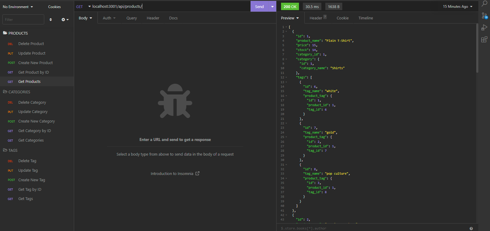

# Octozone-market
Module 13 Challenge by Sergey Holin

GitHub Repo Link: https://github.com/sergeyholin/Octozone-market

Video Demo Link: https://drive.google.com/file/d/1tdVlbtU240XKcjRBR364ykL-mhyvtzHd/view

## ABOUT THE APP:

This application is a working back end framework for e-commerce site. 

## ACCEPTANCE CRITERIA:

```md
GIVEN a functional Express.js API
WHEN I add my database name, MySQL username, and MySQL password to an environment variable file
THEN I am able to connect to a database using Sequelize
WHEN I enter schema and seed commands
THEN a development database is created and is seeded with test data
WHEN I enter the command to invoke the application
THEN my server is started and the Sequelize models are synced to the MySQL database
WHEN I open API GET routes in Insomnia for categories, products, or tags
THEN the data for each of these routes is displayed in a formatted JSON
WHEN I test API POST, PUT, and DELETE routes in Insomnia
THEN I am able to successfully create, update, and delete data in my database
```
## TESTING

The testing of all api routes will be done by utilizing Insomnia API client.

## TECHNOLOGIES USED: 
Insomnia
SQL
NODE.js 
Express.js 
Sequelize
NPM Modules: mysql2, dotenv

## SCREENSHOT:


